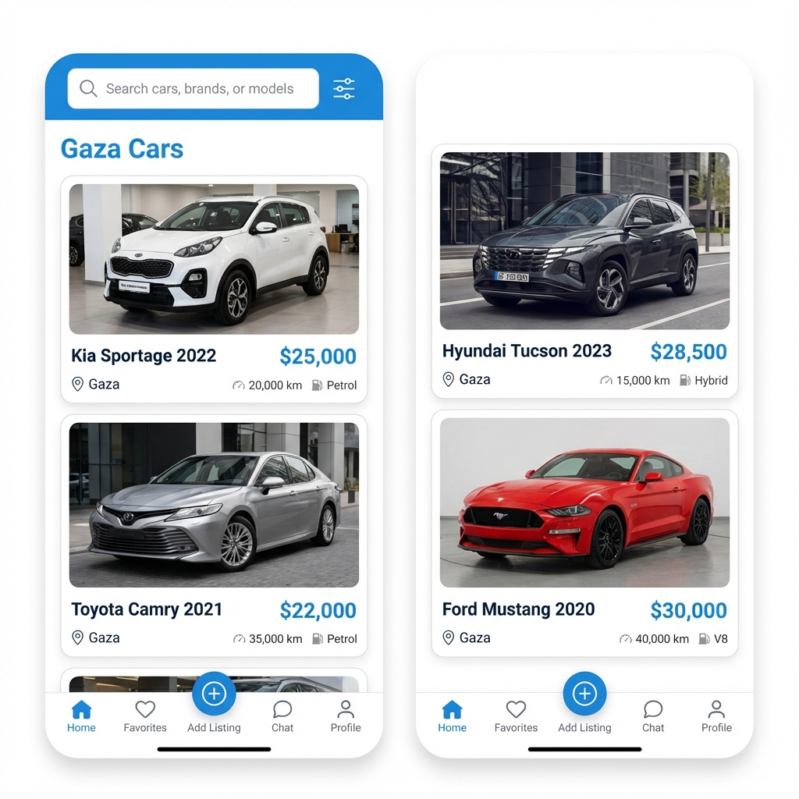
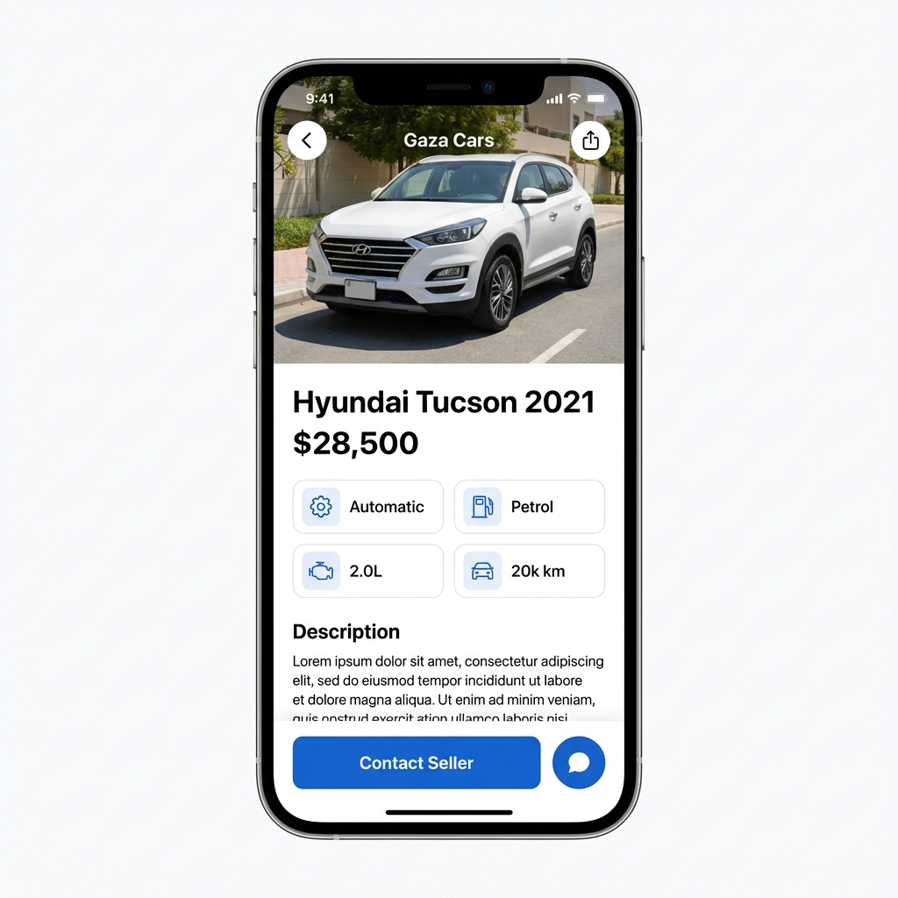

# 🚗 Gaza Cars


**Gaza Cars** is the premium mobile marketplace for buying and selling cars in Gaza. Built with Flutter and Clean Architecture, it offers a seamless, secure, and localized experience for buyers and traders alike.

---

## ✨ Features

*   **🔐 Secure Authentication**: Sign up via Email, Google, or Apple.
*   **👥 Role-Based Access**: Specialized features for **Buyers** and **Traders**.
*   **🚘 Car Listings**: Browse, search, and filter cars by make, model, price, year, and condition.
*   **💬 Real-Time Chat**: Connect directly with sellers through in-app messaging.
*   **❤️ Favorites**: Save listings to your watchlist for quick access.
*   **🌍 Multi-Language Support**: Fully localized in **English** and **Arabic**.
*   **🌓 Theme Support**: Beautiful Light and Dark modes.
*   **🛡️ Admin Dashboard**: Tools for content moderation and user management.

---

## 📱 Screenshots

| Home Feed | Car Details | Chat | Settings |
|:---:|:---:|:---:|:---:|
|  |  |  |  |

*(Note: Screenshots to be added)*

---

## 🛠️ Tech Stack

*   **Framework**: [Flutter](https://flutter.dev/)
*   **Language**: [Dart](https://dart.dev/)
*   **Architecture**: Clean Architecture (Domain, Data, Presentation layers)
*   **State Management**: [Flutter Bloc](https://pub.dev/packages/flutter_bloc)
*   **Dependency Injection**: [GetIt](https://pub.dev/packages/get_it) & [Injectable](https://pub.dev/packages/injectable)
*   **Backend**: [Firebase](https://firebase.google.com/) (Auth, Firestore, Storage, Cloud Messaging)
*   **Navigation**: [GoRouter](https://pub.dev/packages/go_router)
*   **Localization**: [flutter_localizations](https://docs.flutter.dev/ui/accessibility-and-internationalization/internationalization)

---

## 🚀 Getting Started

### Prerequisites

*   [Flutter SDK](https://docs.flutter.dev/get-started/install)
*   [CocoaPods](https://cocoapods.org/) (for iOS)
*   Firebase Project Setup

### Installation

1.  **Clone the repository**
    ```bash
    git clone https://github.com/elamir-mansour/gaza-cars-app.git
    cd gaza-cars-app
    ```

2.  **Install dependencies**
    ```bash
    flutter pub get
    ```

3.  **Setup Firebase**
    *   Configure your Firebase project.
    *   Add `google-services.json` (Android) and `GoogleService-Info.plist` (iOS).

4.  **Run the app**
    ```bash
    flutter run
    ```

---

## ⚖️ Legal

*   [Privacy Policy](https://elamir-mansour.github.io/gaza-cars-app/privacy_policy.html)
*   [Terms of Service](https://elamir-mansour.github.io/gaza-cars-app/terms_of_service.html)

---

## 🤝 Contributing

Contributions are welcome! Please feel free to submit a Pull Request.

---

## 📄 License

This project is licensed under the MIT License - see the [LICENSE](LICENSE) file for details.
