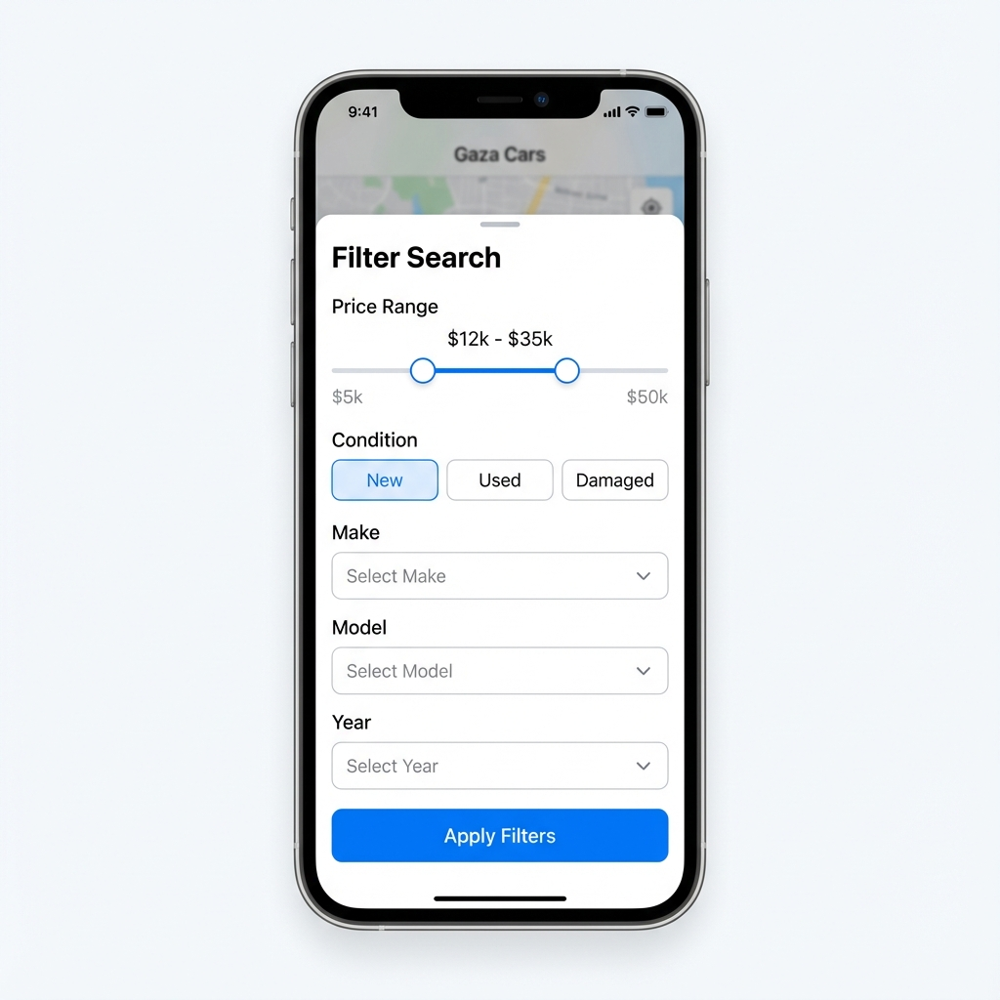
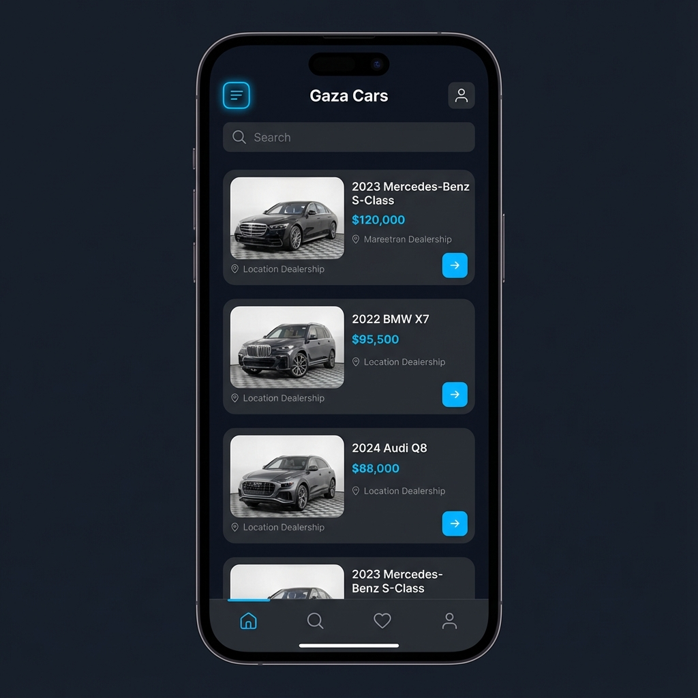

# 🚗 Gaza Cars

<div align="center">
  
  <br>
  <br>
  <h1>The Premium Marketplace for Cars in Gaza</h1>
  <p><i>Buy, Sell, and Trade with Confidence.</i></p>

  [](https://flutter.dev/)
  [](https://dart.dev/)
  [](https://firebase.google.com/)
  [](LICENSE)
</div>

---

## 📱 Overview

**Gaza Cars** is a state-of-the-art mobile application designed to revolutionize the car buying and selling experience in Gaza. Built with **Flutter** and **Clean Architecture**, it combines performance, security, and a stunning user interface to connect buyers and traders seamlessly.

We prioritize **User Experience (UX)** with features like Hero animations, skeleton loading, and intuitive filtering, ensuring a smooth and premium feel.

---

## 📸 Screenshots

<div align="center">
  
  
  
  
</div>

---

## ✨ Key Features

### 🛍️ For Buyers
*   **Advanced Search**: Filter by make, model, year, price, condition, and more using our optimized query engine.
*   **Immersive Details**: View high-res images with pinch-to-zoom and smooth Hero transitions.
*   **Real-Time Chat**: Negotiate directly with sellers using our integrated chat system.
*   **Favorites**: Save listings to your watchlist for quick access.

### 💼 For Traders
*   **Easy Listing**: Add cars in seconds with dependent dropdowns and image uploads.
*   **Analytics**: Track views and engagement on your listings.
*   **Profile Management**: Showcase your business with a verified trader profile.

### 🛡️ Security & Trust
*   **Verified Users**: Phone number verification and social login (Google/Apple).
*   **Moderation**: Admin dashboard to approve listings and ban malicious users.
*   **Reporting**: Robust reporting system for listings and users.

---

## 🛠️ Architecture & Tech Stack

This project follows **Clean Architecture** principles to ensure scalability, testability, and maintainability.

### Layers
1.  **Domain**: Pure Dart code. Entities, UseCases, and Repository Interfaces.
2.  **Data**: Data Sources (Remote/Local), Models, and Repository Implementations.
3.  **Presentation**: BLoCs, Pages, and Widgets.

### Core Libraries
*   **State Management**: `flutter_bloc`
*   **Dependency Injection**: `get_it` & `injectable`
*   **Navigation**: `go_router`
*   **Networking**: `cloud_firestore`, `firebase_auth`
*   **UI Components**: `cached_network_image`, `shimmer`, `flutter_svg`
*   **Localization**: `flutter_localizations` (English & Arabic)

---

## 📂 Project Structure

```
lib/
├── core/                   # Core functionality (DI, Errors, Utils)
├── features/               # Feature-based modules
│   ├── auth/               # Authentication (Login, Register)
│   ├── cars/               # Car Management (List, Details, Add)
│   ├── chat/               # Messaging System
│   ├── home/               # Home Screen & Navigation
│   └── settings/           # User Settings & Profile
├── l10n/                   # Localization files (.arb)
├── shared/                 # Shared widgets & constants
└── main.dart               # App Entry Point
```

---

## 🚀 Getting Started

### Prerequisites
*   [Flutter SDK](https://docs.flutter.dev/get-started/install) (3.10+)
*   [Firebase CLI](https://firebase.google.com/docs/cli)
*   iOS/Android Emulator or Physical Device

### Installation

1.  **Clone the repository**
    ```bash
    git clone https://github.com/elamir-mansour/gaza-cars-app.git
    cd gaza-cars-app
    ```

2.  **Install dependencies**
    ```bash
    flutter pub get
    ```

3.  **Setup Firebase**
    *   Add `google-services.json` to `android/app/`.
    *   Add `GoogleService-Info.plist` to `ios/Runner/`.

4.  **Run the app**
    ```bash
    flutter run
    ```

---

## 🧪 Testing

We maintain a high standard of code quality with comprehensive tests.

### Running Tests
To run all unit and widget tests:

```bash
flutter test
```

### Test Coverage
*   **Unit Tests**: Covers BLoCs (Auth, Car) and business logic.
*   **Widget Tests**: Covers critical UI flows (Login, Home).
*   **Mocks**: Powered by `mocktail` for reliable isolation.

---

## ⚖️ Legal

*   [Privacy Policy](https://elamir-mansour.github.io/gaza-cars-app/privacy_policy.html)
*   [Terms of Service](https://elamir-mansour.github.io/gaza-cars-app/terms_of_service.html)

---

## 🤝 Contributing

Contributions are welcome! Please feel free to submit a Pull Request.

1.  Fork the Project
2.  Create your Feature Branch (`git checkout -b feature/AmazingFeature`)
3.  Commit your Changes (`git commit -m 'Add some AmazingFeature'`)
4.  Push to the Branch (`git push origin feature/AmazingFeature`)
5.  Open a Pull Request

---

<div align="center">
  <sub>Built with ❤️ for Gaza</sub>
</div>
