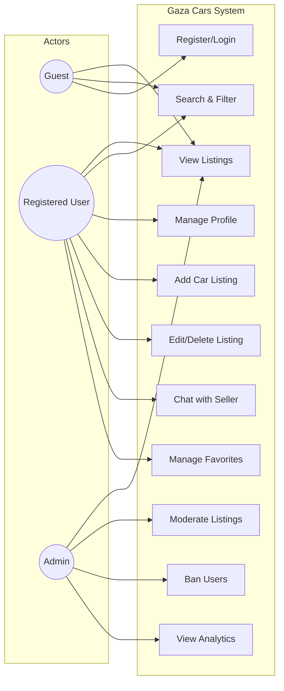
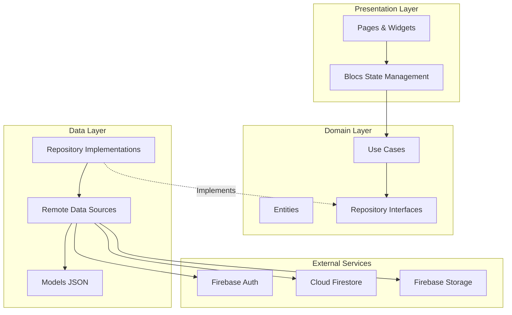
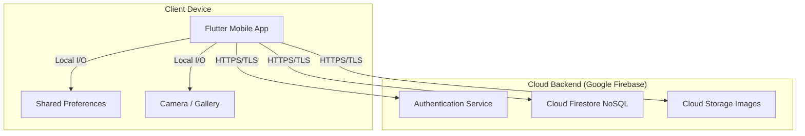
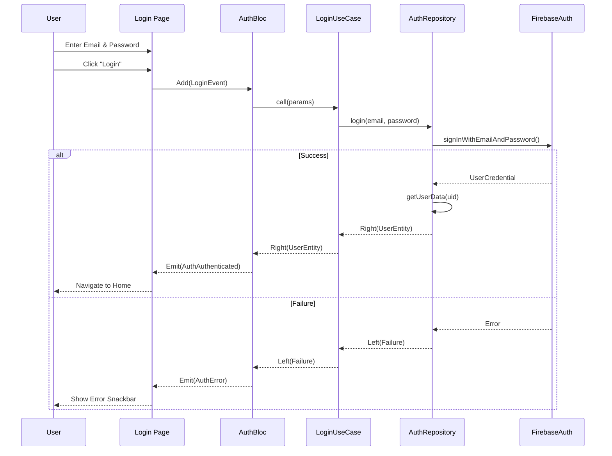
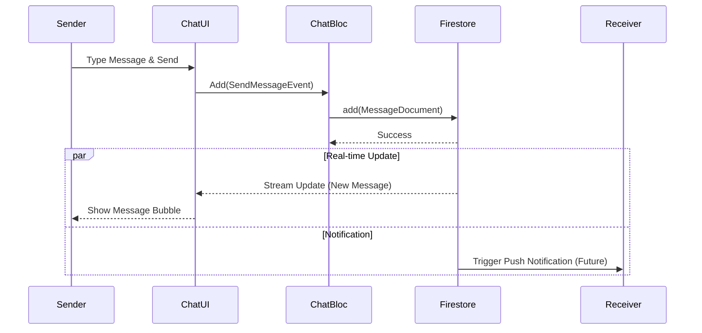
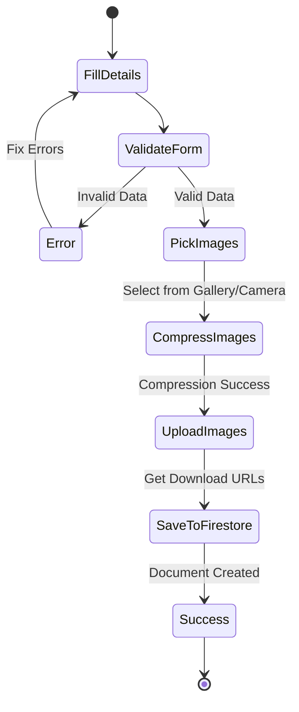
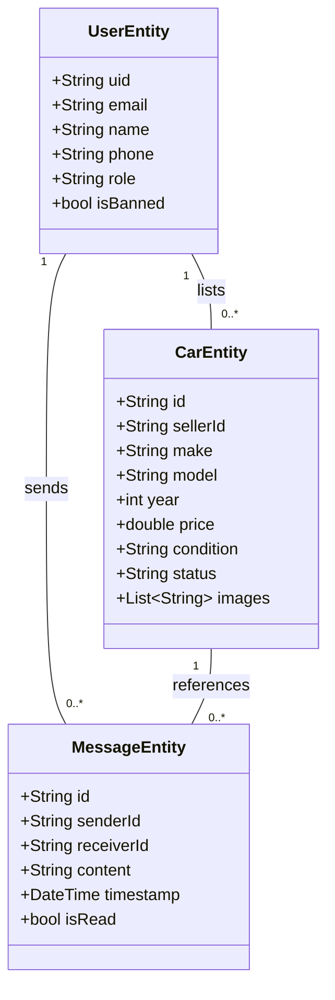

# Software Requirements Specification (SRS)
## Gaza Cars Mobile Application

**Version:** 2.0 (Expanded)  
**Date:** November 25, 2025  
**Prepared for:** Client Review  

---

## 1. Introduction

### 1.1 Purposew
The purpose of this document is to provide a comprehensive, detailed description of the **Gaza Cars** mobile application. It details the functional and non-functional requirements, system architecture, extensive UML diagrams, and the roadmap for future development. This document serves as the primary reference for the development team, stakeholders, and quality assurance.

### 1.2 Scope
**Gaza Cars** is a specialized mobile marketplace for the automotive sector in Gaza. It connects buyers and sellers through a secure, real-time platform. The system leverages **Google Firebase** for a serverless, scalable backend.

### 1.3 Definitions & Acronyms
- **SRS**: Software Requirements Specification
- **Bloc**: Business Logic Component (State Management Pattern)
- **FCM**: Firebase Cloud Messaging
- **DI**: Dependency Injection (using `get_it` and `injectable`)
- **Clean Architecture**: The software design philosophy used (Domain, Data, Presentation layers).

---

## 2. Overall Description

### 2.1 Product Perspective
The application functions as a client-server system where the mobile app (Client) communicates directly with Firebase (Serverless Backend).

### 2.2 User Classes
| User Class | Description | Access Level |
| :--- | :--- | :--- |
| **Guest** | Unregistered user. | Read-only access to public listings. |
| **User (Buyer)** | Registered individual. | Can chat, favorite cars, and view seller contact info. |
| **User (Seller)** | Registered individual. | Can list cars, manage listings, and chat with buyers. |
| **Admin** | Platform moderator. | Full access to dashboard, user management, and content moderation. |

---

## 3. System Diagrams (UML)

### 3.1 Use Case Diagram
High-level view of actor interactions.

### 3.2 System Architecture (Component Diagram)
Shows the modular structure of the application following Clean Architecture.

### 3.3 Deployment Diagram
Physical deployment of artifacts.

### 3.4 Sequence Diagram: User Login
Detailed flow of the authentication process.

### 3.5 Sequence Diagram: Sending a Message
Real-time chat interaction flow.

### 3.6 Activity Diagram: Adding a Car
Workflow for listing a vehicle.

### 3.7 Class Diagram (Domain Entities)
Core data structures.

---

## 4. Functional Requirements (Detailed)

### 4.1 Authentication Module
- **FR-AUTH-01**: System shall allow users to register with Email, Password, Name, and Phone.
- **FR-AUTH-02**: System shall validate email format and password strength (min 6 chars).
- **FR-AUTH-03**: System shall persist user session using secure token storage.
- **FR-AUTH-04**: System shall allow users to update their profile photo (avatar).

### 4.2 Car Management Module
- **FR-CAR-01**: Users shall be able to upload up to 10 images per car.
- **FR-CAR-02**: System shall automatically compress images to max 1080p resolution to optimize bandwidth.
- **FR-CAR-03**: Users must select a "Location" from a predefined list (Gaza City, Rafah, etc.).
- **FR-CAR-04**: Sellers can mark their cars as "Sold", removing them from search results.

### 4.3 Search & Filter Module
- **FR-SRCH-01**: Users can filter cars by Price Range (Min/Max).
- **FR-SRCH-02**: Users can filter by Year Range.
- **FR-SRCH-03**: Search results shall be paginated (lazy loaded) for performance.

### 4.4 Chat Module
- **FR-CHAT-01**: Chat shall be initiated from the "Car Details" page.
- **FR-CHAT-02**: Messages shall be synced in real-time across devices.
- **FR-CHAT-03**: Users shall see a list of all active conversations in the "Inbox" tab.

### 4.5 Admin Module
- **FR-ADM-01**: Admins shall see a "Dashboard" with key metrics (Total Users, Total Cars).
- **FR-ADM-02**: Admins can "Approve" or "Reject" pending car listings.
- **FR-ADM-03**: Admins can "Ban" users, preventing them from logging in.
- **FR-ADM-04**: Banned users shall see a specific error message upon login attempt.

---

## 5. Non-Functional Requirements

### 5.1 Performance
- **Response Time**: API calls should complete within 500ms on 4G networks.
- **Image Upload**: Image compression should take < 1s per image on average devices.

### 5.2 Reliability
- **Availability**: 99.9% uptime provided by Firebase SLA.
- **Data Integrity**: Firestore transactions used for critical updates (e.g., status changes).

### 5.3 Security
- **Encryption**: All data in transit is encrypted via SSL/TLS.
- **Access Control**: Firestore Security Rules enforce ownership (only owners can edit their cars).

---

## 6. Future Roadmap

### Phase 2: Engagement (Month 2)
- Push Notifications (FCM).
- Advanced Filters (Saved Searches).

### Phase 3: Monetization (Month 3)
- Premium Listings (Stripe Integration).
- Trader Verified Accounts.

### Phase 4: Expansion (Month 6)
- Web Application (Flutter Web).
- AI Price Prediction.
